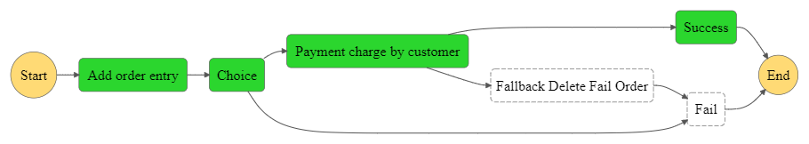
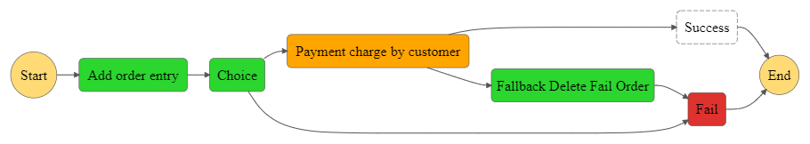

# AWS Step Functions: DynamoDB and Lambda

The state machine starts with an "Input" state, where it reads data from a DynamoDB table.
The data is then passed to a "Validation" state, where it is checked for certain conditions, such as correct format, required fields, etc.
If the validation is successful, the state machine proceeds to a "Process" state, where the data is processed by an AWS Lambda function.

If the Lambda function completes successfully, the state machine proceeds to a "Success" state, where it can perform any additional cleanup or logging.
If the validation or processing fails at any point, the state machine proceeds to a "Fail" state, where it can perform any additional error handling or logging.

Lastly, the state machine will transition to an "End" state, where it will stop.

